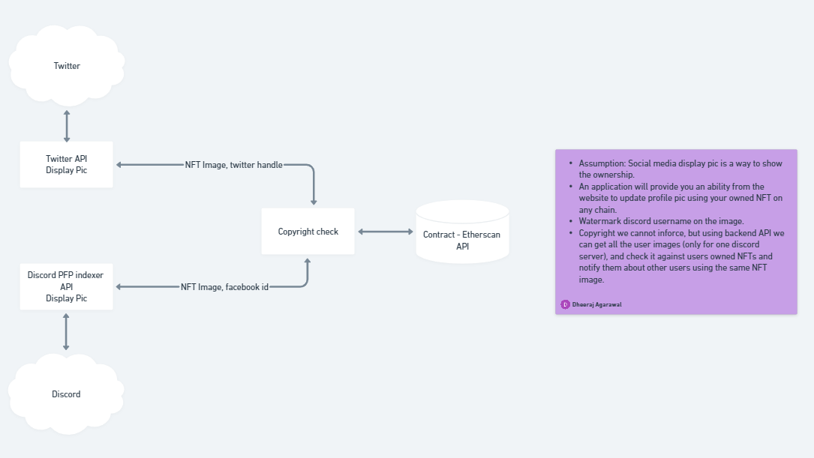

# VeDA Copyright Functionality

This functionality deals with two aspect of the problem of copyright

1. Identifying if NFT has been illegally reproduced or copied.
2. Enforcing the copyright rules

## Assumption

- Social media is used to showcase the ownership of the NFTs.
- For this document we are using Discord as example social media platform
- Assuming copyright breaches are enforced by the countries governing agencies.

## Identification of copyright

In order to identify copyright issues on discord and with the assumption that, the profile picture used on the server and by the users, can be used to establish the ownership of an NFT.

We can integrate with following Discord API to 

- identify and fetch all the server profile pictures on discord
- identify and fetch all the users profile pictures for a specific server on discord

Once we fetch the profile picture, we can compare the picture against the user owned NFT from the wallet used on VeDA marketplace, and we can notify the user of possible copyright breaches.

## Enforcing copyright rules

Once the copyright has been identify we can enforce the copyright and ownership rules in following ways

1. Allow the owner of the NFT to send a discord direct message to the user to stop using the picture specifying the copyright breach. 
2. Taking legal action, with the help of discord and copyright enforcing agencies in the owners specific location.

## Limitation

For the time being, copyright governing bodies, do not recognize the ownership of NFTs and does not have the infrastructure to enforce NFT ownership and copyright rules.

## Architecture

  

