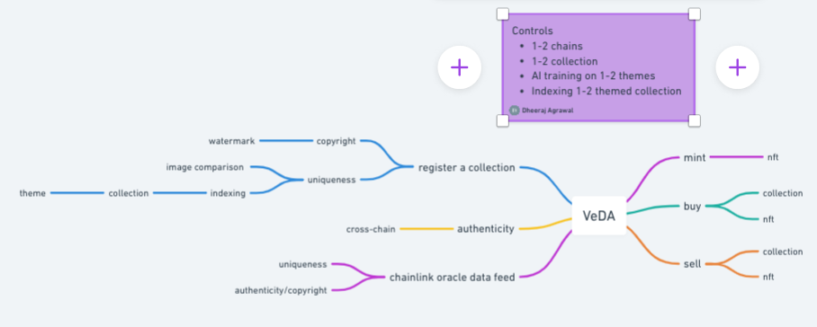
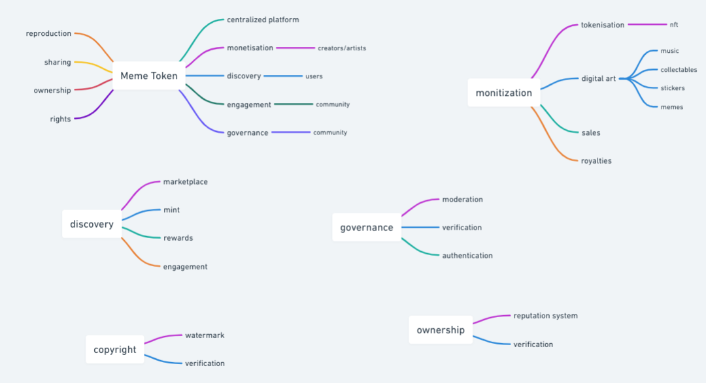
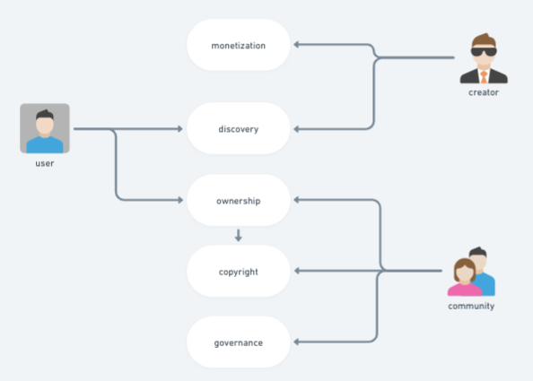
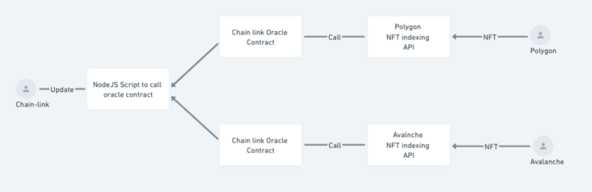
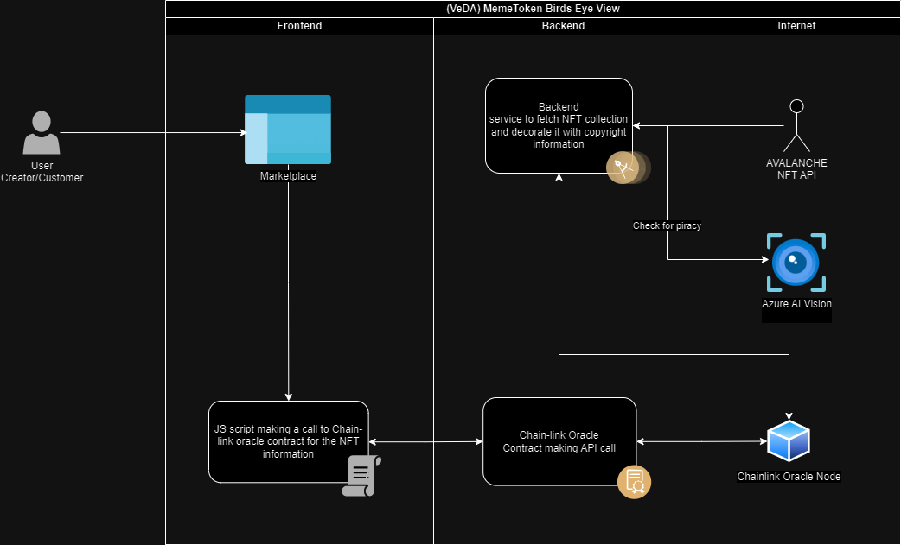

# VeDA

  

## Problem Statement

### Lack of Monetization Options 

Creators and artists struggle to monetize their digital art, as existing platforms prioritize advertising revenue over creator compensation.

### Limited Discovery and Engagement

Users have limited ways to discover and engage with unique digital content, leading to a lack of community interaction and feedback.

### Centralized Platforms

Existing platforms control the distribution and sales of digital art, taking significant fees and prioritizing their own interests over creators and users.

### Effortless Reproduction and Sharing

Digital art reproduction and sharing are effortless, reducing the value of individual pieces and making it difficult for creators to maintain ownership and control.

### No Clear Ownership and Rights

Digital art ownership and rights are unclear, leading to issues with copyright infringement and the misuse of creator content.

### No Community Governance 

Existing platforms lack community governance and moderation, leading to low-quality content and a lack of trust among users.

## Feedback

From the above, the last 3 problems is what most of the existing platforms are missing. The top 3 is very well taken care by the other platform, and there are existing problems with that which are far more complex to solve but simple to implement. Hence, I believe if we want our platform to stand out we must focus on solving the following problems

### Effortless Reproduction and Sharing

Digital art reproduction and sharing are effortless, reducing the value of individual pieces and making it difficult for creators to maintain ownership and control.

This problem can be solved by providing an ability to the community to verify and authenticate digital art to establish copyright. A possible solution could to expose a data feed, much like ChainLink’s price feed. The data feed will have the information to establish the uniqueness and authenticity of the digital art.

### No Clear Ownership and Rights

Digital art ownership and rights are unclear, leading to issues with copyright infringement and the misuse of creator content.
The same data feed as above will be able to establish the ownership and rights and avoid copyright infringement. This can be achieved by indexing the digital art to generate a unique signature (hash, like IPFS hash).

### No Community Governance

Existing platforms lack community governance and moderation, leading to low-quality content and a lack of trust among users.
Communities all over the world can integrate and validate our feed, may be via ChainLink to identify valuable artifacts.

## Digital Art Information Data Feed

This data feed will have following information (still need lots of thought on how to implement)

- Ownership details
- Creator details
- Royalties
- Watermark or signature hashes
- Uniqueness parameters
- Possible selling market price, just like we have when we purchase a house or collectables
- Verified
- Possible listings

## Imagination

If we can index all the NFT’s on all the possible chains (for POC we can do 2 chains atmost), and then expose a feed back to chain link with the information described above. We can prove that a digital ownership and copyright can be implemented with very little friction.

## Implementation

As per my analysis following a proposed solution

We will need a REST API in the backend which will query chain (Polygon and/or avalanche) for a NFT’s, we can make it on-demand based on NFT or we can run it background to index NFT as they are minted. This information can be temporarly be stored on a database once we update the ChainLink feed we can delete it. Need to figure out more details.
This REST API will collect and index all the information regarding NFT in the format I have specified above. The pricing information can be decorated with ChainLinks NFT floor price API (maybe, need to see what information is exposed)

Once we have this information an Chain link oracle contract can be implement to query this information per NFT or in bulk (still have figure out which is more appropiate based on which direction we take)

We also have to expose a JS script to call this contract and then update the Chainlink with this new information. (Again this has to be well thought how we will be doing this).

## Features

  

## Use Case

  

## Analytics API

### Flowchart

  

### Sequence Diagram

  

